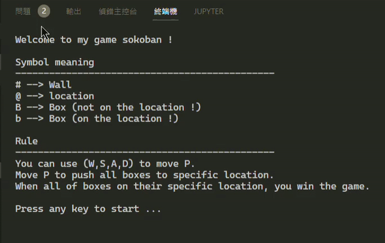

# Command-Line Game Collection

## Platform:

:white_check_mark: Windows 

:x: Mac OS 

:x: Linux 

## Tic-Tac-Toe:

### Introduction

### How to play

## Maze:

### Introduction

### How to play

## Sokoban:

### Introduction

### How to play

## Dino:

### Introduction

### How to play

